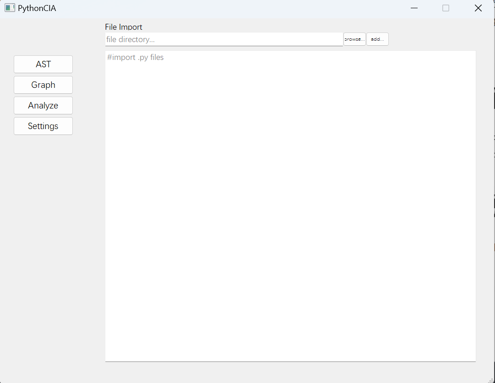
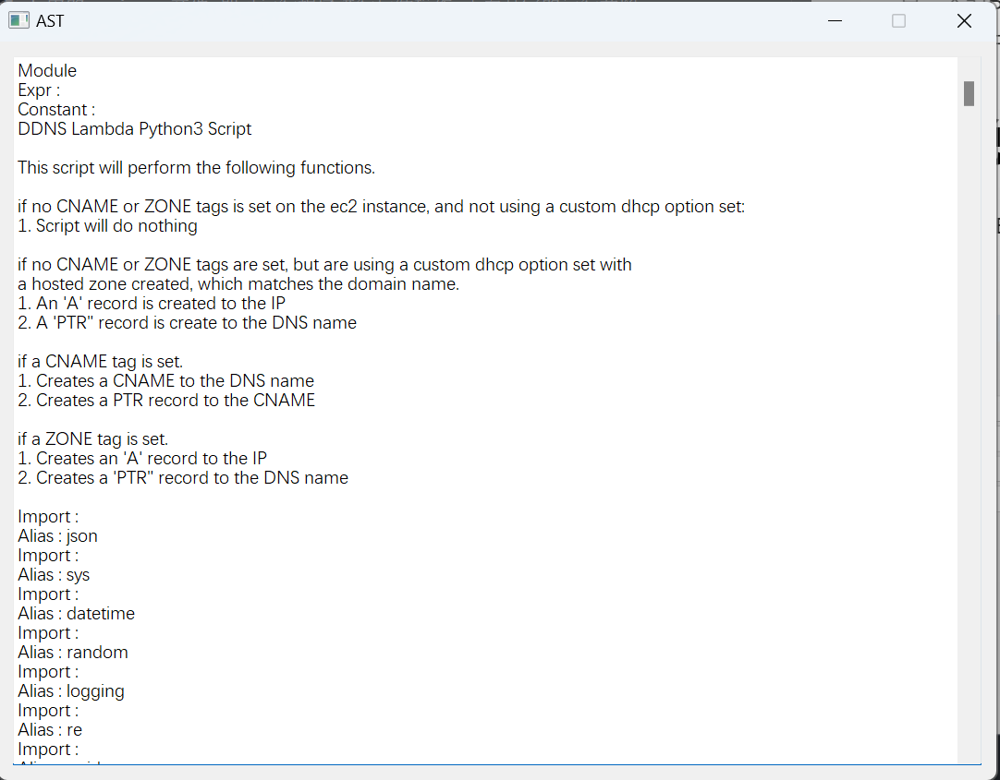
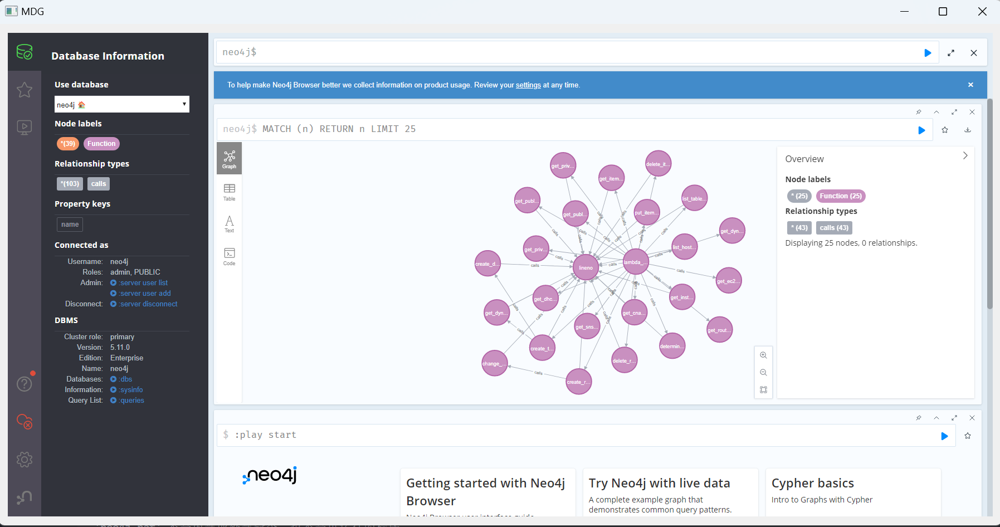

# 写在前面
这个项目是由五位来自于东南大学的本科生所共同开发
以下是他们的github个人主页:(按字母表顺序)

  $\quad$ [Whe1ve](https://github.com/Whe1veWUPK) $\quad$ [Xavoric](https://github.com/Xavoric) 
# 项目简介
* 是一个对Python项目的 ***修改影响分析(Change Impact Analysis)*** 工具
* 100 Percent Python
* 目前还在开发中...（可能会烂掉）
* ...
# 项目结构介绍
* BackEnd 文件夹存放着所有后端脚本
* FrontEnd 文件夹存放着所有前端脚本
* output.txt 是前端输出的测试文件的所有节点信息
* 其它的png图片则是readme.md 文件的配图
# 使用说明
* 运行FrontEnd 中的 main.py文件 即可运行程序进行后续操作 下面是它的运行截图
* 主页面
* AST展示界面
* Graph 交互界面

***Good Luck, hope you have a good day***